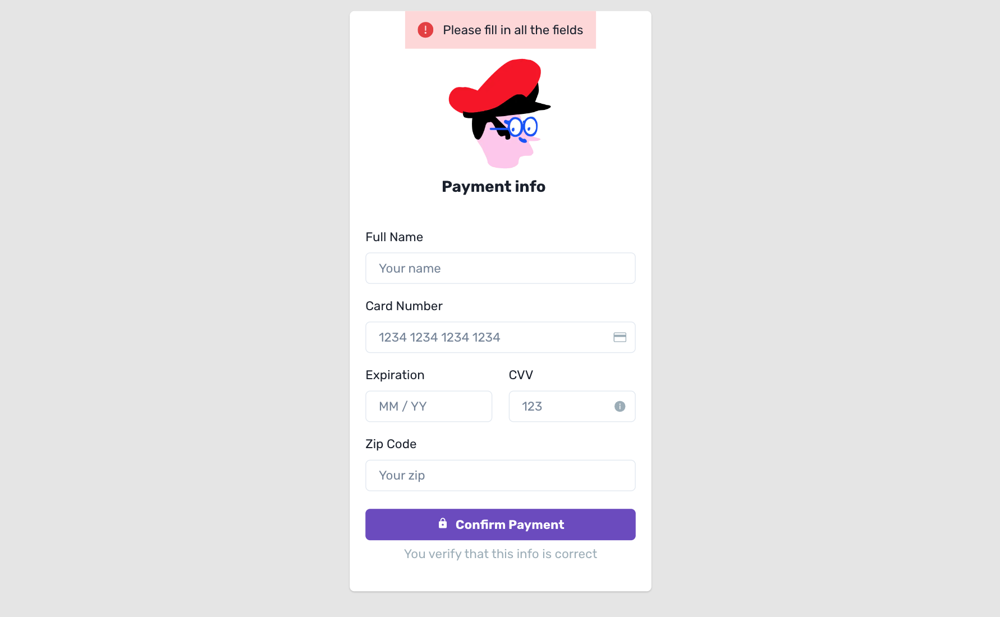
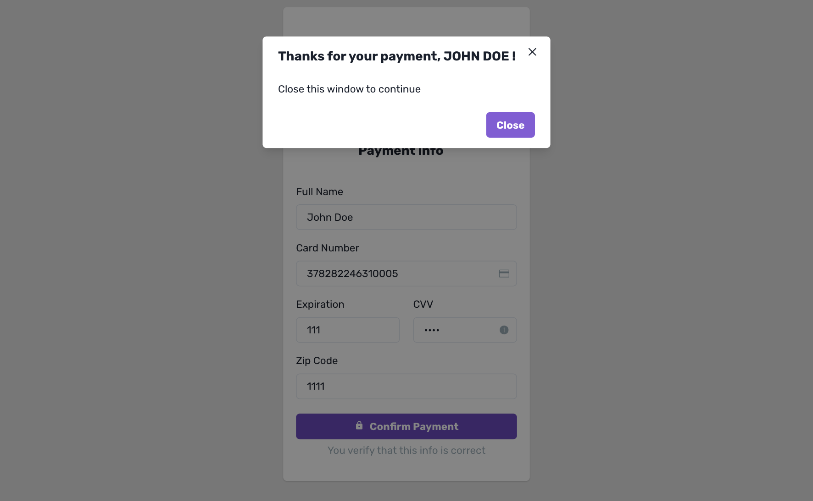

<div id="header" align="center">

  <h1>Talent Squad - Barcelona Digital Talent - III Frontend Challenge</h1>
  
   <p>Checkout form created with React, Next.js and Chakra UI</p>
  
  
  [🔗 Checkout form Vercel deployment](https://checkout-form-lilac.vercel.app/)
  
  
  
 
 
 
 
 


</div>


## Features

- Display error message if a field is empty
- Validate card number with 
- Display error message if card number is not valid
- Display success dialog if all the inputs are completed and the card number is valid


## Installation

npm install

```bash
  npm install checkout-form
  cd checkout-form
```
    
